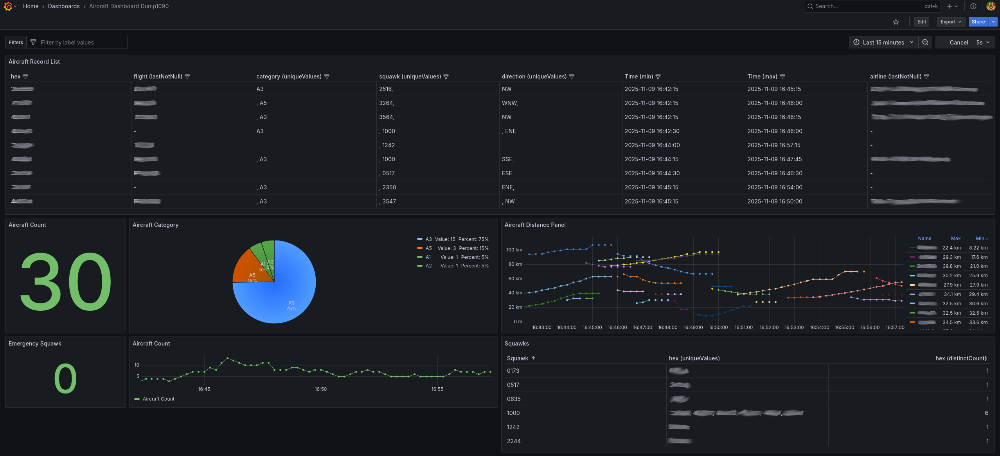
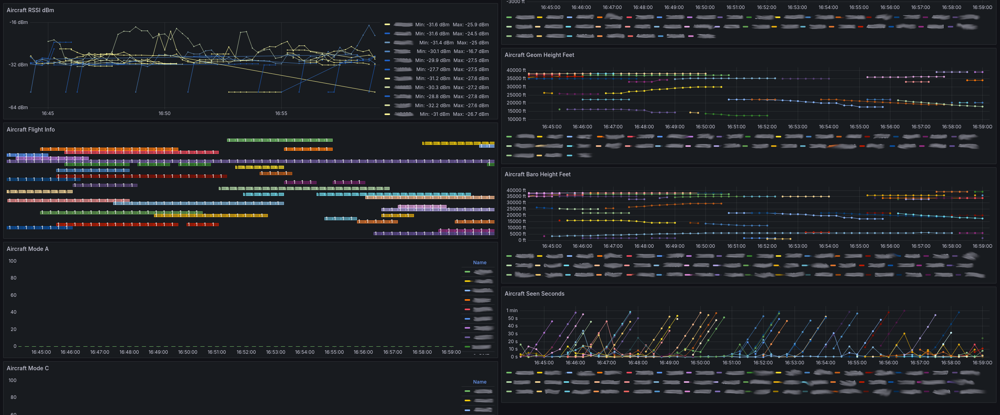

# Dump1090Prom – Aircraft data exporter for Prometheus

A Prometheus exporter for `readsb`/`dump1090` aircraft data.
This exporter converts dump1090 data into [prometheus](https://prometheus.io/) metrics, allowing to monitor and visualizing collected aircraft data in detail.
This repository contains a [Grafana dashboard](dashboards/dump1090prom-grafana-dashboard.json) for visualizing the collected data.

Tested with:
- [flightaware/dump1090](https://github.com/flightaware/dump1090)
- [wiedehopf/readsb](https://github.com/wiedehopf/readsb)

Version: 1.0.3

## Features

- Exports aircraft data as Prometheus metrics for each aircraft
- Supports multiple data sources via a base path:
  - Local directory containing `aircraft.json` and `receiver.json`
  - HTTP/HTTPS base URL exposing `aircraft.json` and `receiver.json`
- Enriches aircraft data with airline information (embedded from Wikipedia data)
- Calculates distance between receiver and aircraft when the receiver position is known (from receiver.json or -lat/-lon override)
- Includes a ready-to-use Grafana dashboard

## Installation

### Prerequisites

- *readsb* or *dump1090* with *rtlsdr* or compatible software generating `aircraft.json` and `receiver.json`

### Option 1: Download a release file

Download the latest release from the [releases page](https://github.com/emschu/dump1090prom/releases).

### Option 2: Install via go

```bash
go install github.com/emschu/dump1090prom@latest
```

### Option 3: Building from source

```bash
git clone https://github.com/emschu/dump1090prom.git
cd dump1090prom
go build
```

### Running permanently (Linux)

If you use Linux, you can use [this systemd unit file](./dev/dump1090prom.service) and copy it
to `/etc/systemd/system/dump1090prom.service`. You may want to adjust the `port` and add custom parameters in `ExecStart`.
Look for the Configuration and CLI section below for more information.

Run the following commands to enable the exporter service permanently in a Linux system using systemd:

```bash
sudo systemctl daemon-reload
sudo systemctl enable dump1090prom 
sudo systemctl start dump1090prom 
```

#### Build for other platforms

```bash
# e.g. for Raspberry Pi
env GOOS=linux GOARCH=arm go build -o dump1090prom
```

## Configuration

The exporter is configured via command-line flags:

- `-base-url` string
  Base URL to the directory where aircraft.json and receiver.json are available
- `-base-path` string
  Local filesystem directory containing aircraft.json and receiver.json, e.g. /var/www/html/data
- `-lat` float
  Override receiver latitude (used for distance calculation)
- `-lon` float
  Override receiver longitude (used for distance calculation)
- `-host` host (default: `127.0.0.1`)
  Override host where /metrics is exposed
- `-port` port (default: `8080`)
  Override port where /metrics is exposed
- `-verbose` bool (default: `false`)
  Enable verbose logging
- `-distance-calc` bool (default: `true`)
  Enable distance calculation to aircraft
- `-airline-label` bool (default: `true`)
  Enable airline labelling
- `-expose-files` bool (default: `true`)
  Expose original aircraft.json and receiver.json files at /aircraft.json and /receiver.json
- `-rolling-map-size` int (default: `1000`)
  Default size of the rolling map for caching

Notes:
- When `-lat` and `-lon` are not provided, the exporter will try to read receiver position from `receiver.json`.
- Distance calculation is performed only when a receiver position is known.
- Provide either `-base-url` or `-base-path` (not both).

## Usage Examples
### Starting `dump1090prom`

Use a local or remotely accessible dump1090 instance:

```bash
./dump1090prom -base-url http://your-dump1090-server:8080/data
# for example for dump1090
./dump1090prom -base-url http://127.0.0.1:8080/data
```

Or without HTTP:

```bash
./dump1090prom -base-path /path/to/dump1090/data
# for example for readsb
./dump1090prom -base-path /run/readsb
```

Show verbose logs:
```bash
./dump1090prom -base-url http://your-dump1090-server:8080/data -verbose
```

Expose metrics on a different port:
```bash
./dump1090prom -base-url http://your-dump1090-server:8080/data -port 9091
```

Typically `dump1090prom` uses `<lat>` and `<lon>` as defined in your `receiver.json`,
if you want to overwrite the receiver position, you can use the `-lat` and `-lon` flags.

```bash
./dump1090prom -base-url http://your-dump1090-server:8080/data -lat <lat> -lon <lon>
```

## Prometheus Configuration

Note: You have to replace `<host_ip>` (and port) with the IP address of your `dump1090prom` server.

```yaml
    scrape_configs:
      - job_name: 'dump1090prom'
        static_configs:
          - targets: ['<host_ip>:8080']
        metrics_path: /metrics
        scrape_interval: 1s
```

## Grafana Dashboard

The project includes an example Grafana dashboard in the `dashboards` directory. 

To use it, import the [`dashboards/dump1090prom-grafana-dashboard.json`](dashboards/dump1090prom-grafana-dashboard.json) JSON definition into your Grafana instance.




## Metrics

### Accessing metrics

```
http://localhost:8080/metrics
http://localhost:8080/aircraft.json
http://localhost:8080/receiver.json
```

#### Metric names

All metrics are prefixed with `dump1090prom_`.

```
dump1090prom_aircraft_adsb_version, Type: GAUGE, Description: Version of the ADS-B protocol in use
dump1090prom_aircraft_altitude_baro_feet, Type: GAUGE, Description: Barometric altitude in feet
dump1090prom_aircraft_altitude_geom_feet, Type: GAUGE, Description: Geometric altitude in feet
dump1090prom_aircraft_barometric_vertical_rate_feet_per_minute, Type: GAUGE, Description: Barometric vertical rate in feet per minute
dump1090prom_aircraft_count, Type: GAUGE, Description: Number of different aircraft currently seen
dump1090prom_aircraft_distance_from_position_meters, Type: GAUGE, Description: Distance in meters from the recording position
dump1090prom_aircraft_flight_info, Type: GAUGE, Description: Metadata about the flight and aircraft
dump1090prom_aircraft_geometric_vertical_rate_feet_per_minute, Type: GAUGE, Description: Geometric vertical rate in feet per minute
dump1090prom_aircraft_ground_speed_knots, Type: GAUGE, Description: Ground speed in knots
dump1090prom_aircraft_gva, Type: GAUGE, Description: Geometric Vertical Accuracy
dump1090prom_aircraft_indicated_airspeed_knots, Type: GAUGE, Description: Indicated airspeed in knots
dump1090prom_aircraft_latitude, Type: GAUGE, Description: Latitude of aircraft
dump1090prom_aircraft_longitude, Type: GAUGE, Description: Longitude of aircraft
dump1090prom_aircraft_mach_number, Type: GAUGE, Description: Mach number
dump1090prom_aircraft_magnetic_heading_degrees, Type: GAUGE, Description: Magnetic heading in degrees
dump1090prom_aircraft_mode_a, Type: GAUGE, Description: Mode A (ident) capability (1 if present)
dump1090prom_aircraft_mode_c, Type: GAUGE, Description: Mode C (altitude) capability (1 if present)
dump1090prom_aircraft_nac_p, Type: GAUGE, Description: Navigation Accuracy Category for Position
dump1090prom_aircraft_nac_v, Type: GAUGE, Description: Navigation Accuracy Category for Velocity
dump1090prom_aircraft_nav_altitude_mcp_feet, Type: GAUGE, Description: MCP/FCU selected altitude in feet
dump1090prom_aircraft_nav_heading_degrees, Type: GAUGE, Description: Selected heading in degrees
dump1090prom_aircraft_nav_qnh_millibar, Type: GAUGE, Description: QNH setting in millibars
dump1090prom_aircraft_nic, Type: GAUGE, Description: Navigation Integrity Category
dump1090prom_aircraft_nic_baro, Type: GAUGE, Description: Navigation Integrity Category for barometric altitude
dump1090prom_aircraft_oat, Type: GAUGE, Description: Outside Air Temperature in Celsius
dump1090prom_aircraft_rc, Type: GAUGE, Description: Radius of containment
dump1090prom_aircraft_roll_degrees, Type: GAUGE, Description: Roll angle in degrees
dump1090prom_aircraft_rssi_dbm, Type: GAUGE, Description: Received Signal Strength Indicator in dBm
dump1090prom_aircraft_sda, Type: GAUGE, Description: System Design Assurance
dump1090prom_aircraft_seen_pos_seconds, Type: GAUGE, Description: Seconds since position was last updated
dump1090prom_aircraft_seen_seconds, Type: GAUGE, Description: Seconds since this aircraft was last seen
dump1090prom_aircraft_sil, Type: GAUGE, Description: Surveillance Integrity Level
dump1090prom_aircraft_spi, Type: GAUGE, Description: Special Position Identification (IDENT)
dump1090prom_aircraft_tat, Type: GAUGE, Description: Total Air Temperature in Celsius
dump1090prom_aircraft_track_degrees, Type: GAUGE, Description: Track angle in degrees (0-359)
dump1090prom_aircraft_track_rate_degrees_per_second, Type: GAUGE, Description: Rate of change of track angle in degrees per second
dump1090prom_aircraft_true_airspeed_knots, Type: GAUGE, Description: True airspeed in knots
dump1090prom_aircraft_true_heading_degrees, Type: GAUGE, Description: Selected true heading in degrees
dump1090prom_now_timestamp, Type: GAUGE, Description: Current timestamp in seconds since the epoch
dump1090prom_total_messages, Type: COUNTER, Description: Total number of messages received
```

Additional metrics are available (see [metric.go](./metric.go) for the full list), including heading, vertical rates, ADS-B version, NAV data, and more.

## Development

### Testing

```bash
go test ./...
```

### Development Environment

The `dev` directory contains resources for setting up a development environment:

- `dev/prometheus`: Prometheus configuration and Podman Compose setup

## License
```
                    GNU AFFERO GENERAL PUBLIC LICENSE
                       Version 3, 19 November 2007

 Copyright (C) 2007 Free Software Foundation, Inc. <http://fsf.org/>
 Everyone is permitted to copy and distribute verbatim copies
 of this license document, but changing it is not allowed.
```

This project is licensed under the terms of the license included in the [`LICENSE`](./LICENSE) file.